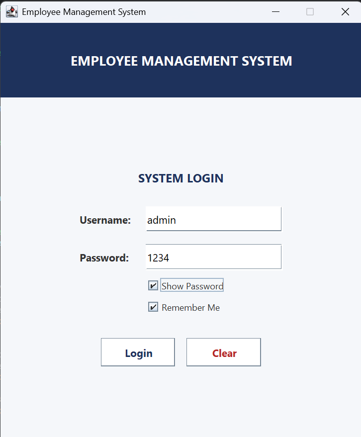
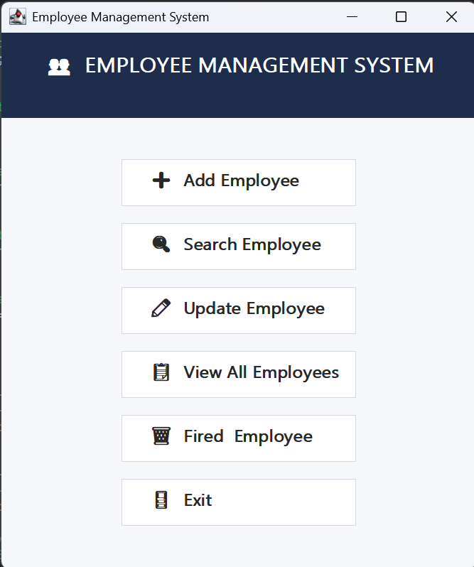
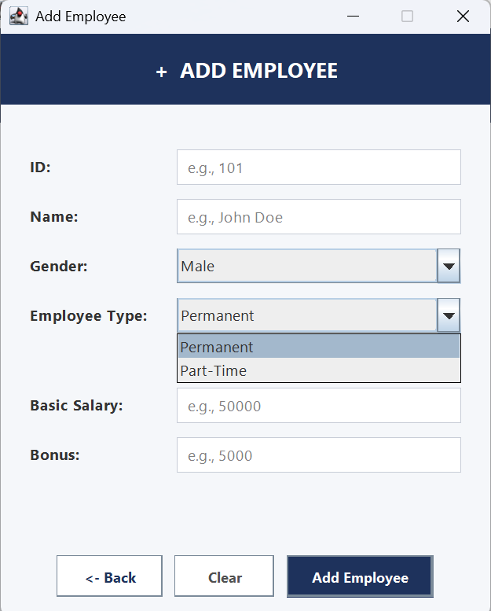
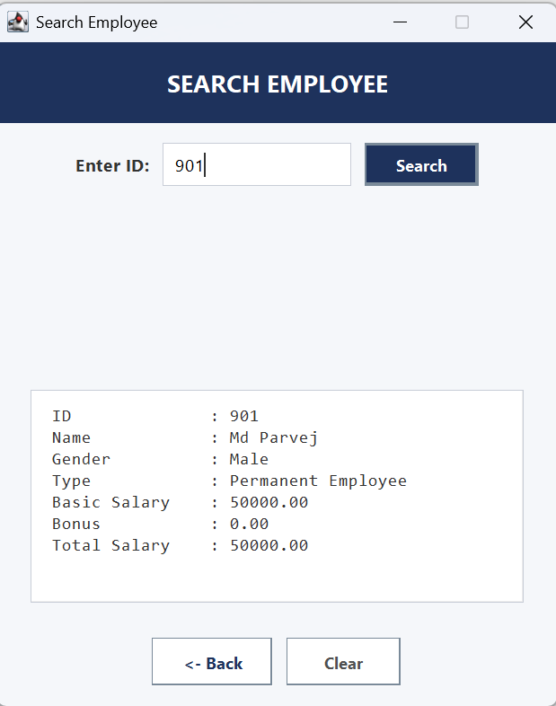
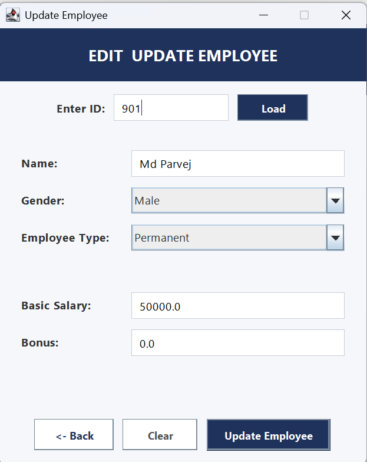
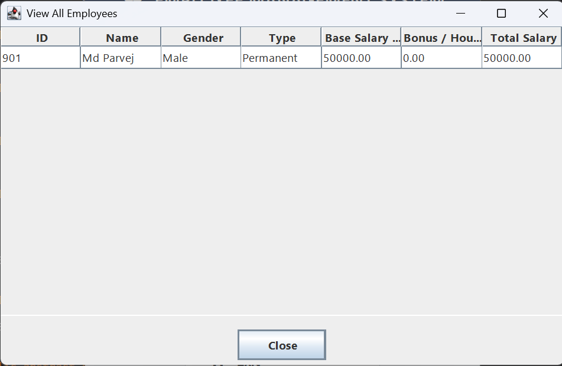

# 👥 Employee Management System (Java Swing + OOP)

A feature-rich, desktop-based **Employee Management System** built with **Java (Swing GUI)** and designed strictly around **Object-Oriented Programming (OOP)** principles. This application features secure admin authentication, dynamic card-layout forms, strict input validation, polymorphism-based salary calculation, and interactive tabular views.

---

## 📸 User Interface Showcase

| Login Screen | System Dashboard |
| :---: | :---: |
|  |  |
| *Secure Login with Remember Me & Password Visibility* | *Main Navigation Dashboard with 6 Quick Actions* |

| Add Employee Form | Search Employee Screen |
| :---: | :---: |
|  |  |
| *Dynamic CardLayout Form with Strict Validation* | *Search by ID with Monospaced Aligned Details* |

| Update Employee Form | View All Employees Table |
| :---: | :---: |
|  |  |
| *Two-Stage Load & Update with Subtype Conversion* | *Read-Only JTable Displaying Full Roster* |

---

## 🌟 Key Features & Capabilities

### 1. 🔐 Authentication & Session Security
* **Admin Authentication**: Default credentials (`admin` / `1234`).
* **Remember Me**: Uses `java.util.prefs.Preferences` API to persist the username across application restarts.
* **Interactive UI Controls**: Toggle password visibility with a checkbox and automatic focus listeners for field placeholders.
* **Keyboard Shortcut**: Press `Enter` anywhere on the login form to authenticate immediately.

### 2. ➕ Dynamic Employee Onboarding
* **Employee Categories**:
  * **Permanent Employee**: Receives a `Basic Salary` plus optional `Bonus`.
  * **Part-Time Employee**: Receives salary calculated dynamically as `Working Hours × Rate Per Hour` (no bonus).
* **CardLayout GUI Integration**: Dynamically toggles input fields based on the selected employee type.
* **Strict Validation Rules**:
  * **ID Check**: Must be a positive integer and unique (prevents duplicate IDs).
  * **Name Check**: Enforces letters only using regex `^[a-zA-Z\s.\-]+$` (blocks numbers/special symbols).
  * **Financial Check**: Rejects negative salary, hourly rate, or working hour inputs.
  * **Visual Error Feedback**: Highlights invalid fields with a prominent red border and inline error label.

### 3. 🔍 Search & Monospaced Formatting
* Instant lookup by Employee ID.
* Outputs full employee record in a `JTextArea` styled with `Consolas` monospaced font to guarantee vertical colon alignment (`%-15s : %s`).

### 4. ✏️ Smart Update & Subtype Conversion
* **Two-Stage Workflow**: Enter ID ➔ Click **Load** ➔ Edit populating fields ➔ Click **Update**.
* **Type Switch Support**: If a Permanent employee is updated to Part-Time (or vice versa), the system automatically handles subtype conversion without losing the employee's ID.

### 5. 📋 Read-Only Tabular View
* Displays all registered employees inside a custom non-editable `JTable` inside a `JScrollPane`.
* Automatically formats and displays Base Salary, Rate, Hours, Bonus, and calculated Total Salary to 2 decimal places.

### 6. 🗑️ Safe Employee Deletion
* Requires integer ID entry and displays a confirmation dialog (`JOptionPane.showConfirmDialog`) before removing records from memory.

---

## 🔑 Changing Default Credentials

Default login credentials:
* **Username**: `admin`
* **Password**: `1234`

To change the default username or password, update the fields inside [`src/GUI/LoginFrame.java`](src/GUI/LoginFrame.java):

```java
// Credentials configuration in LoginFrame.java
private final String CORRECT_USERNAME = "admin";  // Modify username here
private final String CORRECT_PASSWORD = "1234";   // Modify password here
```

---

## 📐 Object-Oriented Programming (OOP) Architecture

This project is designed as an educational and practical demonstration of core OOP concepts:

| OOP Concept | Implementation Detail | Location |
| :--- | :--- | :--- |
| **Encapsulation** | Private fields (`id`, `name`, `gender`, `basicSalary`, etc.) accessible only via public getters and setters. | [`Employee.java`](src/Folder/Employee.java), [`PermanentEmployee.java`](src/Folder/PermanentEmployee.java) |
| **Inheritance** | Derived classes `PermanentEmployee` and `PartTimeEmployee` inherit common properties from abstract parent class `Employee`. | [`PermanentEmployee.java`](src/Folder/PermanentEmployee.java), [`PartTimeEmployee.java`](src/Folder/PartTimeEmployee.java) |
| **Abstraction** | `Employee` is an abstract class declaring abstract methods (`getBaseSalary()`, `getBonus()`, `getType()`). | [`Employee.java`](src/Folder/Employee.java) |
| **Interface** | `Payable` interface defines contract method `double getTotalSalary()`. | [`Payable.java`](src/Folder/Payable.java) |
| **Polymorphism** | Overridden methods calculate total compensation dynamically based on object subtype at runtime. | [`Employee.java`](src/Folder/Employee.java#L63-L66) |

---

## 🛠️ Class & Method Reference

### Backend Core (`src/Folder`)

#### 1. [`Payable.java`](src/Folder/Payable.java) *(Interface)*
* `double getTotalSalary()`: Contract method for total salary calculation.

#### 2. [`Employee.java`](src/Folder/Employee.java) *(Abstract Class)*
* `getId()`, `getName()`, `getGender()` / Setters: Encapsulated getter/setter accessors.
* `abstract double getBaseSalary()`: Must be implemented by concrete subtypes.
* `abstract double getBonus()`: Must be implemented by concrete subtypes.
* `abstract String getType()`: Returns `"Permanent"` or `"Part-Time"`.
* `double getTotalSalary()`: Default implementation returning `getBaseSalary() + getBonus()`.

#### 3. [`PermanentEmployee.java`](src/Folder/PermanentEmployee.java) *(Concrete Class)*
* `PermanentEmployee(...)`: Constructor initializing base attributes + `basicSalary` and `bonus`.
* `getBaseSalary()`: Overridden to return `basicSalary`.
* `getBonus()`: Overridden to return `bonus`.

#### 4. [`PartTimeEmployee.java`](src/Folder/PartTimeEmployee.java) *(Concrete Class)*
* `PartTimeEmployee(...)`: Constructor initializing base attributes + `workingHours` and `ratePerHour`.
* `getBaseSalary()`: Overridden to return `workingHours * ratePerHour`.
* `getBonus()`: Overridden to return `0`.

#### 5. [`EmployeeManager.java`](src/Folder/EmployeeManager.java) *(Controller / Data Manager)*
* `boolean employeeExists(int id)`: Checks if ID exists in the list.
* `boolean addPermanentEmployee(...)`: Creates and appends a `PermanentEmployee`.
* `boolean addPartTimeEmployee(...)`: Creates and appends a `PartTimeEmployee`.
* `Employee searchEmployee(int id)`: Returns matching employee object or `null`.
* `boolean updatePermanentEmployee(...)`: Updates an existing permanent employee.
* `boolean updatePartTimeEmployee(...)`: Updates an existing part-time employee.
* `boolean deleteEmployee(int id)`: Removes an employee by ID.
* `ArrayList<Employee> getEmployeeList()`: Returns the list for GUI table population.
* `int getTotalEmployee()`: Returns current employee count.

---

## 📁 Project Structure

```
EmployeeManagement/
├── images/                         # GUI Screenshots & Interface Showcase
│   ├── Loginframe.png
│   ├── SystemMenu.png
│   ├── AddEmployeeFrame.png
│   ├── SearchemployeeFrame.png
│   ├── UpdateEmployeeframe.png
│   └── AllEmployeeFrame.png
│
├── src/
│   ├── Folder/                     # Backend Logic & Data Models
│   │   ├── Payable.java            # Interface
│   │   ├── Employee.java           # Abstract Parent Class
│   │   ├── PermanentEmployee.java    # Concrete Child Class (Permanent)
│   │   ├── PartTimeEmployee.java     # Concrete Child Class (Part-Time)
│   │   ├── EmployeeManager.java      # Data Store & CRUD Controller
│   │   └── Main.java                 # Main Entry Point
│   │
│   └── GUI/                        # Frontend Windows (Java Swing)
│       ├── LoginFrame.java           # Authentication Window
│       ├── MainFrame.java            # Main Menu Dashboard
│       ├── AddEmployeeFrame.java     # Add Form Window
│       ├── SearchEmployeeFrame.java  # Search Window
│       ├── UpdateEmployeeFrame.java  # Update Form Window
│       ├── ViewEmployeeFrame.java    # JTable View Window
│       └── DeleteEmployeeFrame.java  # Delete Window
│
├── Project_Report.pdf              # Comprehensive Project Report
├── README.md                       # Documentation
├── .project                        # Eclipse Project Metadata
└── .classpath                      # Eclipse Classpath Config
```

---

## 🚀 Getting Started & Setup

### Prerequisites
* **Java Development Kit (JDK 8 or higher)**
* **Any Java IDE (Eclipse, IntelliJ IDEA, VS Code) or Command Line (CLI)**

---

### 💻 How to Run the Application

1. **Clone this repository**:
   ```bash
   git clone https://github.com/xyzbuddy/OOP_Employee_Management.git
   ```

#### 🔹 Option 1: Eclipse IDE
1. Open Eclipse and select `File` ➔ `Import...`.
2. Choose `General` ➔ `Existing Projects into Workspace` ➔ Click `Next`.
3. Select the `Employee_Management` directory and click `Finish`.
4. Open `src/Folder/Main.java` ➔ Right-click ➔ `Run As` ➔ `Java Application`.

#### 🔹 Option 2: IntelliJ IDEA
1. Open IntelliJ IDEA and select `File` ➔ `Open...`.
2. Select the `Employee_Management` folder and click `OK`.
3. Ensure JDK (Java 8+) is assigned in `Project Structure`.
4. Open `src/Folder/Main.java` ➔ Click the green ▶️ **Run** button.

#### 🔹 Option 3: Visual Studio Code (VS Code)
1. Open VS Code and select `File` ➔ `Open Folder...`.
2. Select the `Employee_Management` directory.
3. Install the **Extension Pack for Java** extension if not already installed.
4. Open `src/Folder/Main.java` and click **Run** above `main`.

#### 🔹 Option 4: Command Line / Terminal (CLI)
1. Open terminal in the project root directory.
2. Compile source files into the `bin` directory:
   ```bash
   javac -d bin src/Folder/*.java src/GUI/*.java
   ```
3. Launch the application:
   ```bash
   java -cp bin Folder.Main
   ```

---

## 📄 Documentation & Lab Report
This repository includes a full project report PDF ([`Project_Report.pdf`](Project_Report.pdf)). Students and developers can refer to the report for complete system flowcharts, class diagrams, and lab assignment submission guidelines.
